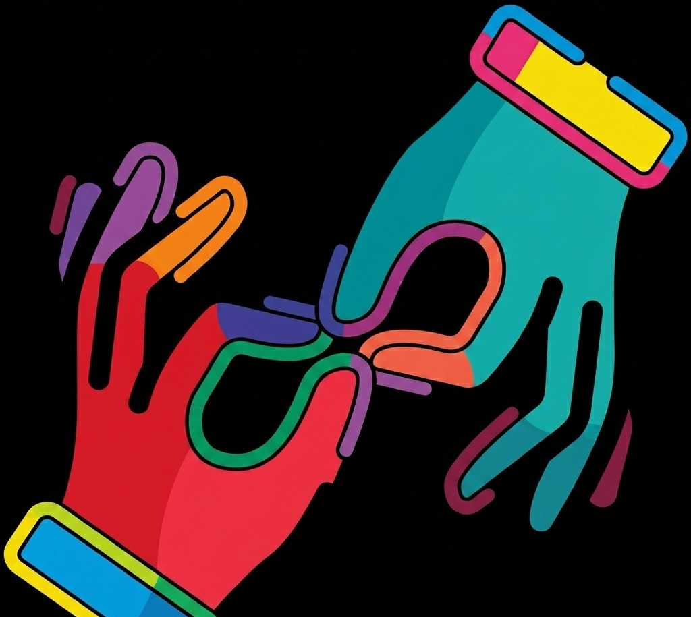
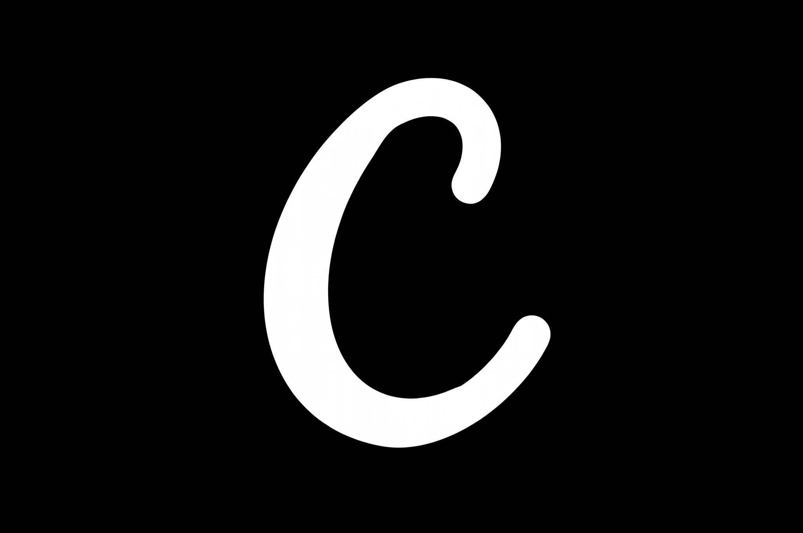

<h2>
  👋 Hey, I am Manas
  &nbsp;&nbsp;
</h2>

	My curiosity for technology began in primary school, where I first discovered a deep interest in computers that never faded. That early fascination shaped everything that followed — the subjects I chose, the problems I gravitated toward, and the kind of builder I became.
    Now in my second year of Computer Science and Engineering at Manipal University Jaipur, I've moved well beyond coursework. I build and ship AI-powered products that tackle real-world problems — from healthcare tools to FetchrLy, a job search automation platform that helps candidates cut through the noise and reach the right recruiters faster.
    Each project has pushed me to go deeper — not just into code, but into product thinking, system design, and what it actually means to create something useful.
    I'm not waiting to graduate to start building. I already am.

## 🚀 Projects

-  [ResuAI](https://resuai.co.in/) - AI-powered resume maker.
-  [MedMate AI Health Assistant](https://med-mate-ai-health-assistant-v2.vercel.app/) - Intelligent healthcare and symptom analysis platform.
-  [Cortex AI](https://cortex-ai-v1.vercel.app/) - Advanced AI conversational assistant.
-  [NewsScope AI News Detector](https://newsscope-ai-news-detector.vercel.app/) - Tool to detect fake news and verify information.
-  [Weather Buddy](https://weather-buddy-v1.vercel.app/) - Real-time weather forecasting application.
-  [MedMate ML](https://medmate-ml.vercel.app/) - Machine learning backend for MedMate.
-  [Cosmos Galaxy](https://cosmos-galaxy.vercel.app/) - Interactive 3D visualization of the universe.
-  [Gesture Sense AI](https://gesture-sense-ai.vercel.app/) - AI-powered gesture recognition system.
-  [TaskMate](https://taskmate-chi-three.vercel.app/) - Smart task management and productivity app.
-  [CredChain Verify](https://cred-chain-verify.vercel.app/) - Blockchain-based credential verification.
-  [GraspAI](https://graspai-zeta.vercel.app/) - AI learning and comprehension tool.
- 🏃 [Poly Dash Game](https://poly-dash-game.vercel.app/) - 3D endless runner game.
-  [My Portfolio](https://manas-rohilla.vercel.app/) - Personal portfolio showcasing my projects and skills.
-  [FetchrLy](https://github.com/rohillamanas06-commits/FetchrLy) - AI Cold Email Agent and career assistant platform.

